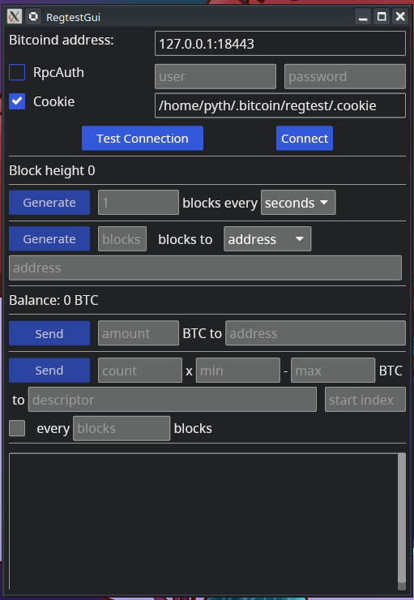

# Regtest Gui

This GUI is an helper to control a bitcoin regtest with some automation features.

## Block generation
 - Generate blocks periodically: generate X blocks every Y seconds/minutes.
 - Generate X blocks to a fixed address.
 - Generate X blocks to randoms addresses.
 - Generate X blocks to self (the wallet controlled by the gui via bitcoin-core, evvery address is a new one).
 - Generate X blocks to a descriptor (funding an external wallet w/o address reuse).

## Send coins from the controlled wallet:
- Send one coin of X BTC to an address
- Send a batch of X coins w/  random amount in a min-max range to a descriptor to a descriptor.
- Send on average a batch every X block (to be combined w/ the periodical block generation feature).
